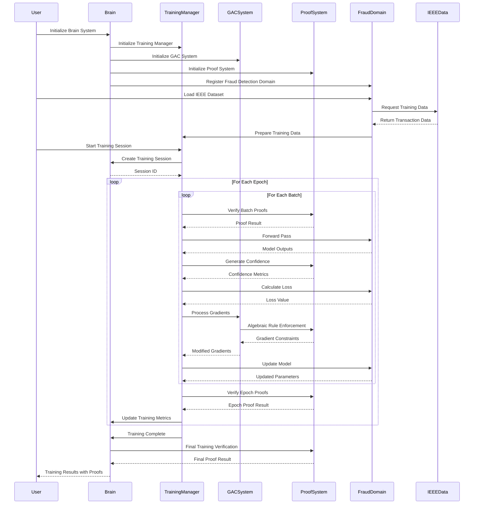
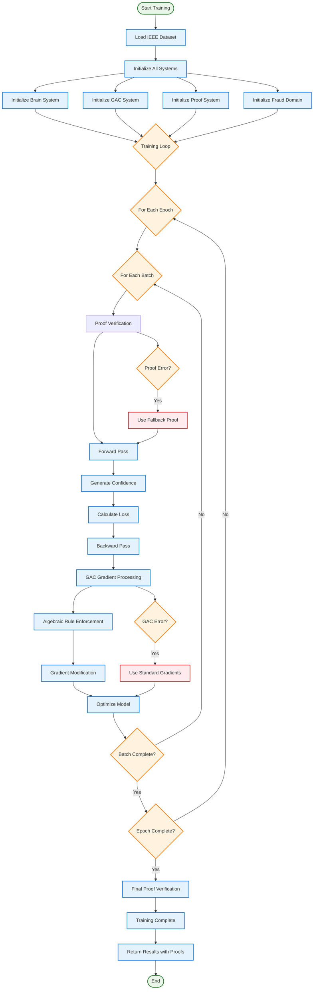
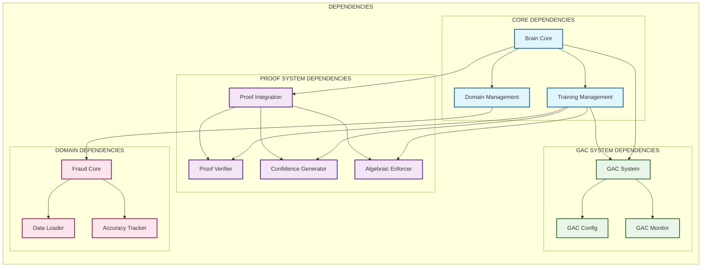

# Saraphis AI System - Complete Workflow & Training Cycle

```mermaid
graph TB
    %% Main System Components
    subgraph "SARAPHIS AI SYSTEM"
        subgraph "BRAIN SYSTEM"
            Brain[Brain Core System]
            DomainRegistry[Domain Registry]
            DomainRouter[Domain Router]
            DomainState[Domain State Manager]
        end
        
        subgraph "PROOF SYSTEM"
            ProofVerifier[Financial Proof Verifier]
            ProofIntegration[Proof Integration Manager]
            ConfidenceGen[Confidence Generator]
            AlgebraicEnforcer[Algebraic Rule Enforcer]
        end
        
        subgraph "GAC SYSTEM"
            GACSystem[Gradient Ascent Clipping]
            GACConfig[GAC Configuration]
            GACMonitor[GAC Monitor]
        end
        
        subgraph "TRAINING INFRASTRUCTURE"
            TrainingManager[Training Manager]
            TrainingSession[Training Session]
            TrainingConfig[Training Configuration]
        end
        
        subgraph "IEEE FRAUD DETECTION DOMAIN"
            DataLoader[IEEE Data Loader]
            FraudCore[Enhanced Fraud Core]
            AccuracyTracker[Accuracy Tracker]
            RealTimeMonitor[Real-time Monitor]
        end
    end
    
    %% External Components
    subgraph "EXTERNAL SYSTEMS"
        IEEEData[(IEEE Fraud Dataset)]
        ProductionExec[Production Training Execution]
        TestSuite[Test Suite]
    end
    
    %% Workflow Connections
    %% Initialization Flow
    Brain --> DomainRegistry
    Brain --> DomainRouter
    Brain --> DomainState
    
    %% Proof System Integration
    Brain --> ProofVerifier
    Brain --> ProofIntegration
    Brain --> ConfidenceGen
    Brain --> AlgebraicEnforcer
    
    %% GAC System Integration
    Brain --> GACSystem
    Brain --> GACConfig
    Brain --> GACMonitor
    
    %% Training Infrastructure
    Brain --> TrainingManager
    TrainingManager --> TrainingSession
    TrainingManager --> TrainingConfig
    
    %% Domain Integration
    DomainRegistry --> FraudCore
    DomainRouter --> FraudCore
    DomainState --> FraudCore
    
    %% Data Flow
    IEEEData --> DataLoader
    DataLoader --> FraudCore
    FraudCore --> AccuracyTracker
    FraudCore --> RealTimeMonitor
    
    %% Training Execution Flow
    ProductionExec --> TrainingManager
    TrainingManager --> GACSystem
    TrainingManager --> ProofVerifier
    TrainingManager --> ConfidenceGen
    TrainingManager --> AlgebraicEnforcer
    
    %% Testing
    TestSuite --> Brain
    TestSuite --> TrainingManager
    TestSuite --> FraudCore
    
    %% Styling
    classDef brainSystem fill:#e1f5fe,stroke:#01579b,stroke-width:2px
    classDef proofSystem fill:#f3e5f5,stroke:#4a148c,stroke-width:2px
    classDef gacSystem fill:#e8f5e8,stroke:#1b5e20,stroke-width:2px
    classDef trainingInfra fill:#fff3e0,stroke:#e65100,stroke-width:2px
    classDef fraudDomain fill:#fce4ec,stroke:#880e4f,stroke-width:2px
    classDef external fill:#f1f8e9,stroke:#33691e,stroke-width:2px
    
    class Brain,DomainRegistry,DomainRouter,DomainState brainSystem
    class ProofVerifier,ProofIntegration,ConfidenceGen,AlgebraicEnforcer proofSystem
    class GACSystem,GACConfig,GACMonitor gacSystem
    class TrainingManager,TrainingSession,TrainingConfig trainingInfra
    class DataLoader,FraudCore,AccuracyTracker,RealTimeMonitor fraudDomain
    class IEEEData,ProductionExec,TestSuite external
```

```mermaid
sequenceDiagram
    participant User
    participant Brain
    participant TrainingManager
    participant GACSystem
    participant ProofSystem
    participant FraudDomain
    participant IEEEData
    
    %% Initialization Phase
    User->>Brain: Initialize Brain System
    Brain->>TrainingManager: Initialize Training Manager
    Brain->>GACSystem: Initialize GAC System
    Brain->>ProofSystem: Initialize Proof System
    Brain->>FraudDomain: Register Fraud Detection Domain
    
    %% Data Loading Phase
    User->>FraudDomain: Load IEEE Dataset
    FraudDomain->>IEEEData: Request Training Data
    IEEEData-->>FraudDomain: Return Transaction Data
    FraudDomain->>TrainingManager: Prepare Training Data
    
    %% Training Session Start
    User->>TrainingManager: Start Training Session
    TrainingManager->>Brain: Create Training Session
    Brain-->>TrainingManager: Session ID
    
    %% Training Loop
    loop For Each Epoch
        loop For Each Batch
            %% Pre-Training Proof Verification
            TrainingManager->>ProofSystem: Verify Batch Proofs
            ProofSystem-->>TrainingManager: Proof Result
            
            %% Forward Pass
            TrainingManager->>FraudDomain: Forward Pass
            FraudDomain-->>TrainingManager: Model Outputs
            
            %% Confidence Generation
            TrainingManager->>ProofSystem: Generate Confidence
            ProofSystem-->>TrainingManager: Confidence Metrics
            
            %% Loss Calculation
            TrainingManager->>FraudDomain: Calculate Loss
            FraudDomain-->>TrainingManager: Loss Value
            
            %% Backward Pass with GAC
            TrainingManager->>GACSystem: Process Gradients
            GACSystem->>ProofSystem: Algebraic Rule Enforcement
            ProofSystem-->>GACSystem: Gradient Constraints
            GACSystem-->>TrainingManager: Modified Gradients
            
            %% Optimization
            TrainingManager->>FraudDomain: Update Model
            FraudDomain-->>TrainingManager: Updated Parameters
        end
        
        %% Epoch Completion
        TrainingManager->>ProofSystem: Verify Epoch Proofs
        ProofSystem-->>TrainingManager: Epoch Proof Result
        TrainingManager->>Brain: Update Training Metrics
    end
    
    %% Training Completion
    TrainingManager->>Brain: Training Complete
    Brain->>ProofSystem: Final Training Verification
    ProofSystem-->>Brain: Final Proof Result
    Brain-->>User: Training Results with Proofs
```

```mermaid
flowchart TD
    %% Training Cycle Flow
    Start([Start Training]) --> LoadData[Load IEEE Dataset]
    LoadData --> InitSystems[Initialize All Systems]
    
    InitSystems --> BrainInit[Initialize Brain System]
    InitSystems --> GACInit[Initialize GAC System]
    InitSystems --> ProofInit[Initialize Proof System]
    InitSystems --> DomainInit[Initialize Fraud Domain]
    
    BrainInit --> TrainingLoop{Training Loop}
    GACInit --> TrainingLoop
    ProofInit --> TrainingLoop
    DomainInit --> TrainingLoop
    
    TrainingLoop --> EpochLoop{For Each Epoch}
    EpochLoop --> BatchLoop{For Each Batch}
    
    %% Batch Processing
    BatchLoop --> ProofVerify[Proof Verification]
    ProofVerify --> ForwardPass[Forward Pass]
    ForwardPass --> ConfidenceGen[Generate Confidence]
    ConfidenceGen --> LossCalc[Calculate Loss]
    LossCalc --> BackwardPass[Backward Pass]
    
    %% GAC and Proof Integration
    BackwardPass --> GACProcess[GAC Gradient Processing]
    GACProcess --> AlgebraicEnforce[Algebraic Rule Enforcement]
    AlgebraicEnforce --> GradientMod[Gradient Modification]
    GradientMod --> Optimize[Optimize Model]
    Optimize --> BatchComplete{Batch Complete?}
    
    BatchComplete -->|No| BatchLoop
    BatchComplete -->|Yes| EpochComplete{Epoch Complete?}
    
    EpochComplete -->|No| EpochLoop
    EpochComplete -->|Yes| FinalProof[Final Proof Verification]
    
    FinalProof --> TrainingComplete[Training Complete]
    TrainingComplete --> Results[Return Results with Proofs]
    Results --> End([End])
    
    %% Error Handling
    ProofVerify --> ProofError{Proof Error?}
    ProofError -->|Yes| ProofFallback[Use Fallback Proof]
    ProofFallback --> ForwardPass
    
    GACProcess --> GACError{GAC Error?}
    GACError -->|Yes| GACFallback[Use Standard Gradients]
    GACFallback --> Optimize
    
    %% Styling
    classDef process fill:#e3f2fd,stroke:#1976d2,stroke-width:2px
    classDef decision fill:#fff3e0,stroke:#f57c00,stroke-width:2px
    classDef error fill:#ffebee,stroke:#c62828,stroke-width:2px
    classDef startEnd fill:#e8f5e8,stroke:#2e7d32,stroke-width:2px
    
    class LoadData,InitSystems,BrainInit,GACInit,ProofInit,DomainInit,ForwardPass,ConfidenceGen,LossCalc,BackwardPass,GACProcess,AlgebraicEnforce,GradientMod,Optimize,FinalProof,TrainingComplete,Results process
    class TrainingLoop,EpochLoop,BatchLoop,BatchComplete,EpochComplete,ProofError,GACError decision
    class ProofFallback,GACFallback error
    class Start,End startEnd
```

```mermaid
graph LR
    %% Component Dependencies
    subgraph "DEPENDENCIES"
        subgraph "CORE DEPENDENCIES"
            BrainCore[Brain Core]
            DomainMgmt[Domain Management]
            TrainingMgmt[Training Management]
        end
        
        subgraph "PROOF SYSTEM DEPENDENCIES"
            ProofVerifier[Proof Verifier]
            ConfidenceGen[Confidence Generator]
            AlgebraicEnforcer[Algebraic Enforcer]
            ProofIntegration[Proof Integration]
        end
        
        subgraph "GAC SYSTEM DEPENDENCIES"
            GACSystem[GAC System]
            GACConfig[GAC Config]
            GACMonitor[GAC Monitor]
        end
        
        subgraph "DOMAIN DEPENDENCIES"
            FraudCore[Fraud Core]
            DataLoader[Data Loader]
            AccuracyTracker[Accuracy Tracker]
        end
    end
    
    %% Dependency Flow
    BrainCore --> DomainMgmt
    BrainCore --> TrainingMgmt
    BrainCore --> ProofIntegration
    BrainCore --> GACSystem
    
    DomainMgmt --> FraudCore
    TrainingMgmt --> ProofVerifier
    TrainingMgmt --> ConfidenceGen
    TrainingMgmt --> AlgebraicEnforcer
    TrainingMgmt --> GACSystem
    
    ProofIntegration --> ProofVerifier
    ProofIntegration --> ConfidenceGen
    ProofIntegration --> AlgebraicEnforcer
    
    GACSystem --> GACConfig
    GACSystem --> GACMonitor
    
    FraudCore --> DataLoader
    FraudCore --> AccuracyTracker
    
    %% Styling
    classDef core fill:#e1f5fe,stroke:#01579b,stroke-width:2px
    classDef proof fill:#f3e5f5,stroke:#4a148c,stroke-width:2px
    classDef gac fill:#e8f5e8,stroke:#1b5e20,stroke-width:2px
    classDef domain fill:#fce4ec,stroke:#880e4f,stroke-width:2px
    
    class BrainCore,DomainMgmt,TrainingMgmt core
    class ProofVerifier,ConfidenceGen,AlgebraicEnforcer,ProofIntegration proof
    class GACSystem,GACConfig,GACMonitor gac
    class FraudCore,DataLoader,AccuracyTracker domain
``` 